# Gallery

Every example in `examples/diagrams/`, rendered by this implementation (no browser).
Regenerate with `cargo run --release --example gallery`.

## agentflow

Source: [`examples/diagrams/agentflow.mmd`](../examples/diagrams/agentflow.mmd) · rendered in 486.02µs

source

```mermaid
agentflow-beta TB
  brief["Release brief"]@{ shape: input }
  flow writer["Drafting Agent"]
    draft["Draft the notes"]@{ shape: task }
    lookup["changelog_search"]@{ shape: tool }
    guide["Tone of voice"]@{ shape: refdoc }
    draft --> lookup
    draft -.- guide
  end
  flow reviewer["Review Agent"]
    check["Check the claims"]@{ shape: task }
    ok["Accurate?"]@{ shape: decision }
    check --> ok
  end
  publish["Publish"]@{ shape: action }
  brief --> writer
  writer --> reviewer
  ok -- yes --> publish
  ok -- no --x check
```

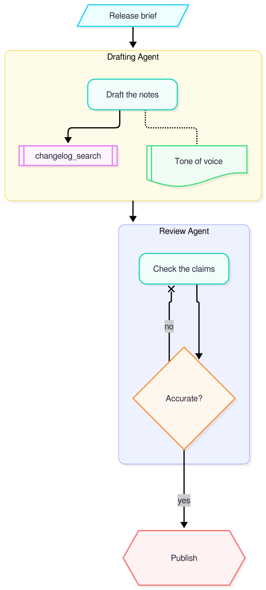

## architecture

Source: [`examples/diagrams/architecture.mmd`](../examples/diagrams/architecture.mmd) · rendered in 258.34µs

source

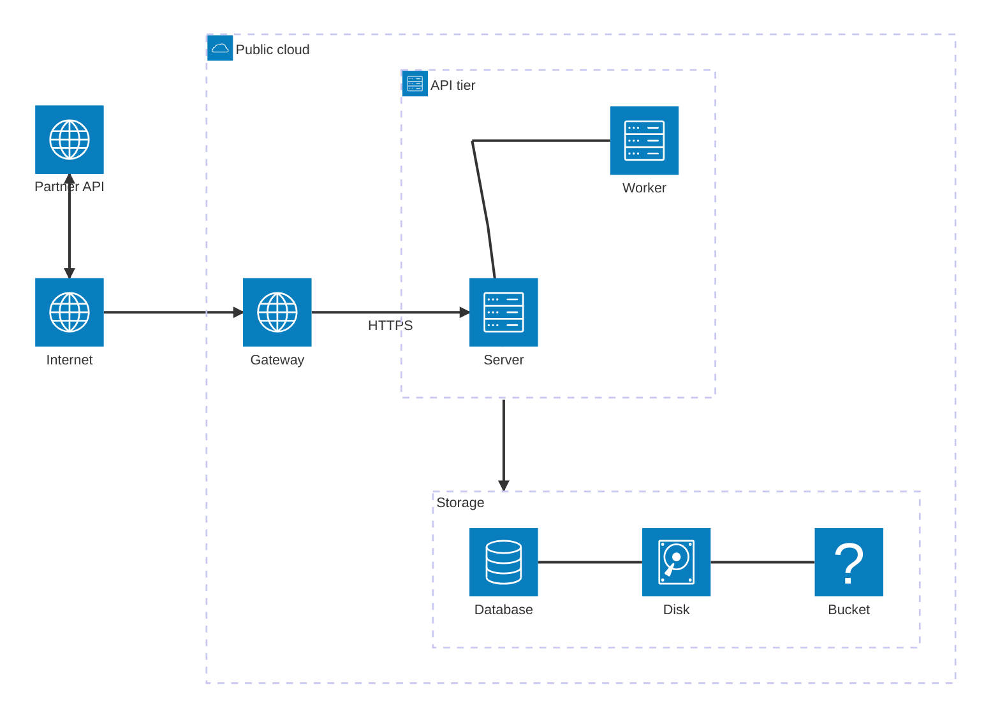
```mermaid
architecture-beta
    title Web platform
    group public(cloud)[Public cloud]
    group api(server)[API tier] in public
    group storage[Storage] in public

    service internet(internet)[Internet]
    service gateway(internet)[Gateway] in public
    service server(server)[Server] in api
    service worker(server)[Worker] in api
    service db(database)[Database] in storage
    service disk(disk)[Disk] in storage
    service bucket(logos:aws-s3)[Bucket] in storage
    service ext(internet)[Partner API]
    junction hub in api

    internet:R --> L:gateway
    gateway:R -[HTTPS]-> L:server
    server:B -- T:hub
    hub:R -- L:worker
    server{group}:B --> T:db{group}
    db:R -- L:disk
    disk:R -- L:bucket
    ext:B <--> T:internet
```

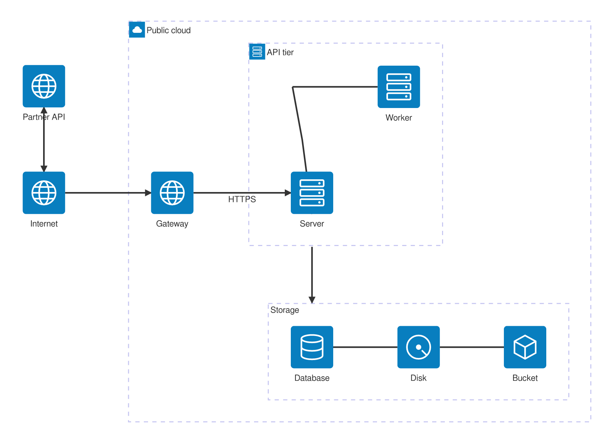

## block

Source: [`examples/diagrams/block.mmd`](../examples/diagrams/block.mmd) · rendered in 276.63µs

source

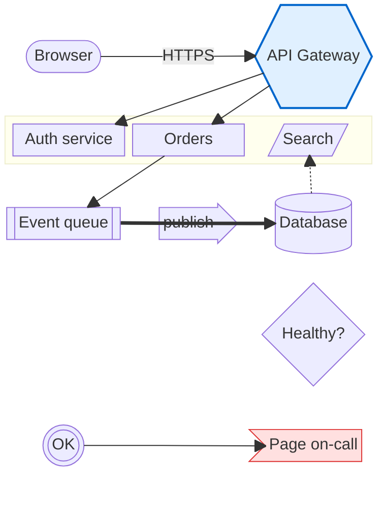
```mermaid
block-beta
  columns 3
  client(["Browser"]) space gw{{"API Gateway"}}
  block:services:3
    columns 3
    auth["Auth service"] orders["Orders"] search[/"Search"/]
  end
  queue[["Event queue"]] arrow<["publish"]>(right) db[("Database")]
  space:2 decide{"Healthy?"}
  ok((("OK"))) space alert>"Page on-call"]

  client -- "HTTPS" --> gw
  gw --> auth
  gw --> orders
  orders --> queue
  db -.-> search
  ok --> alert
  queue ==> db

  classDef warn fill:#ffe0e0,stroke:#d33,color:#600
  class alert warn
  style gw fill:#e0f0ff,stroke:#06c,stroke-width:2px
```

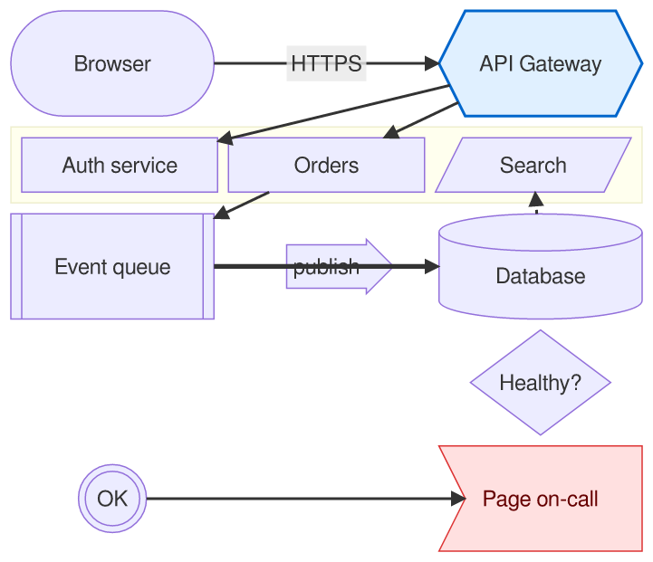

## c4-container

Source: [`examples/diagrams/c4-container.mmd`](../examples/diagrams/c4-container.mmd) · rendered in 359.97µs

source

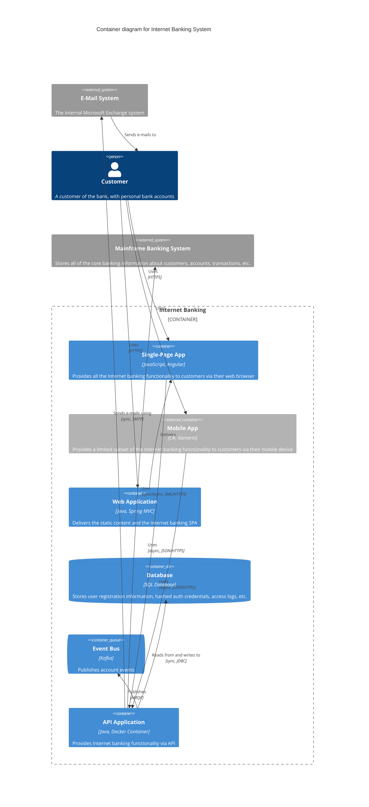
```mermaid
C4Container
  title Container diagram for Internet Banking System

  System_Ext(email_system, "E-Mail System", "The internal Microsoft Exchange system", $tags="v1.0")
  Person(customer, Customer, "A customer of the bank, with personal bank accounts", $tags="v1.0")

  Container_Boundary(c1, "Internet Banking") {
    Container(spa, "Single-Page App", "JavaScript, Angular", "Provides all the Internet banking functionality to customers via their web browser")
    Container_Ext(mobile_app, "Mobile App", "C#, Xamarin", "Provides a limited subset of the Internet banking functionality to customers via their mobile device")
    Container(web_app, "Web Application", "Java, Spring MVC", "Delivers the static content and the Internet banking SPA")
    ContainerDb(database, "Database", "SQL Database", "Stores user registration information, hashed auth credentials, access logs, etc.")
    ContainerQueue(events, "Event Bus", "Kafka", "Publishes account events")
    Container(backend_api, "API Application", "Java, Docker Container", "Provides Internet banking functionality via API")
  }

  System_Ext(banking_system, "Mainframe Banking System", "Stores all of the core banking information about customers, accounts, transactions, etc.")

  Rel(customer, web_app, "Uses", "HTTPS")
  Rel(customer, spa, "Uses", "HTTPS")
  Rel(customer, mobile_app, "Uses")

  Rel(web_app, spa, "Delivers")
  Rel(spa, backend_api, "Uses", "async, JSON/HTTPS")
  Rel(mobile_app, backend_api, "Uses", "async, JSON/HTTPS")
  Rel_Back(database, backend_api, "Reads from and writes to", "sync, JDBC")
  Rel(backend_api, events, "Publishes", "AMQP")

  Rel(email_system, customer, "Sends e-mails to")
  Rel(backend_api, email_system, "Sends e-mails using", "sync, SMTP")
  Rel(backend_api, banking_system, "Uses", "sync/async, XML/HTTPS")

  UpdateLayoutConfig($c4ShapeInRow="3", $c4BoundaryInRow="1")
```

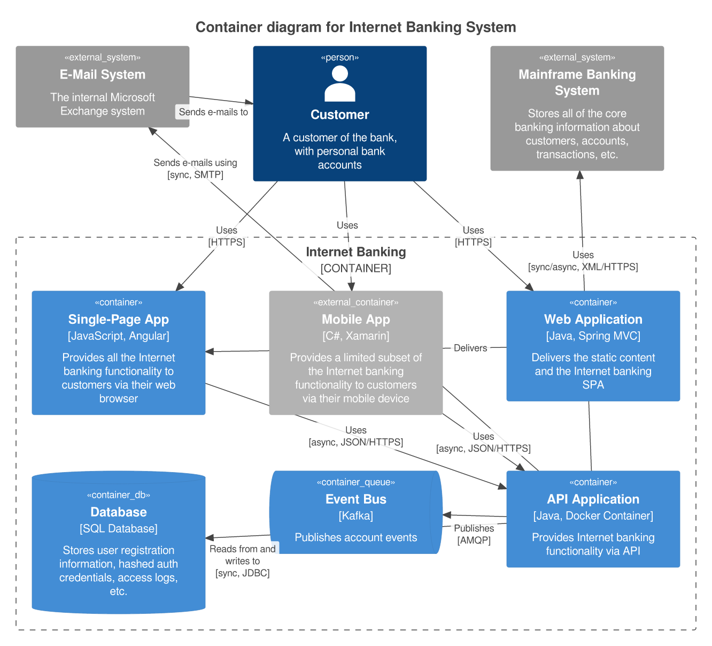

## c4

Source: [`examples/diagrams/c4.mmd`](../examples/diagrams/c4.mmd) · rendered in 418.16µs

source

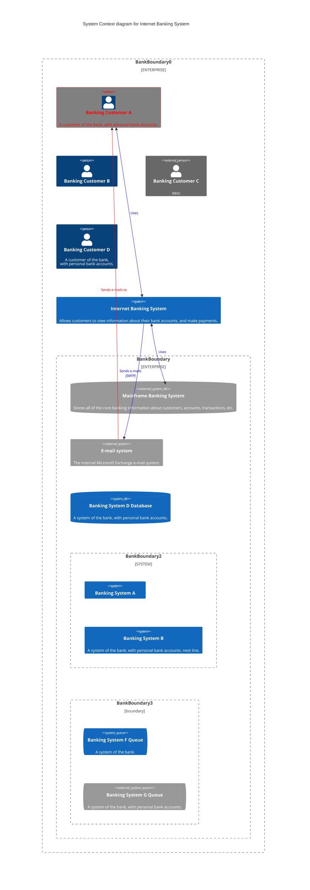
```mermaid
C4Context
  title System Context diagram for Internet Banking System
  Enterprise_Boundary(b0, "BankBoundary0") {
    Person(customerA, "Banking Customer A", "A customer of the bank, with personal bank accounts.")
    Person(customerB, "Banking Customer B")
    Person_Ext(customerC, "Banking Customer C", "desc")

    Person(customerD, "Banking Customer D", "A customer of the bank, <br/> with personal bank accounts.")

    System(SystemAA, "Internet Banking System", "Allows customers to view information about their bank accounts, and make payments.")

    Enterprise_Boundary(b1, "BankBoundary") {

      SystemDb_Ext(SystemE, "Mainframe Banking System", "Stores all of the core banking information about customers, accounts, transactions, etc.")

      System_Boundary(b2, "BankBoundary2") {
        System(SystemA, "Banking System A")
        System(SystemB, "Banking System B", "A system of the bank, with personal bank accounts. next line.")
      }

      System_Ext(SystemC, "E-mail system", "The internal Microsoft Exchange e-mail system.")
      SystemDb(SystemD, "Banking System D Database", "A system of the bank, with personal bank accounts.")

      Boundary(b3, "BankBoundary3", "boundary") {
        SystemQueue(SystemF, "Banking System F Queue", "A system of the bank.")
        SystemQueue_Ext(SystemG, "Banking System G Queue", "A system of the bank, with personal bank accounts.")
      }
    }
  }

  BiRel(customerA, SystemAA, "Uses")
  BiRel(SystemAA, SystemE, "Uses")
  Rel(SystemAA, SystemC, "Sends e-mails", "SMTP")
  Rel(SystemC, customerA, "Sends e-mails to")

  UpdateElementStyle(customerA, $fontColor="red", $bgColor="grey", $borderColor="red")
  UpdateRelStyle(customerA, SystemAA, $textColor="blue", $lineColor="blue", $offsetX="5")
  UpdateRelStyle(SystemAA, SystemE, $textColor="blue", $lineColor="blue", $offsetY="-10")
  UpdateRelStyle(SystemAA, SystemC, $textColor="blue", $lineColor="blue", $offsetY="-40", $offsetX="-50")
  UpdateRelStyle(SystemC, customerA, $textColor="red", $lineColor="red", $offsetX="-50", $offsetY="20")

  UpdateLayoutConfig($c4ShapeInRow="3", $c4BoundaryInRow="1")
```

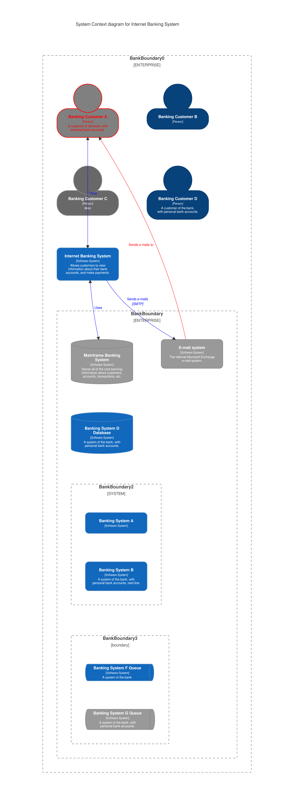

## class

Source: [`examples/diagrams/class.mmd`](../examples/diagrams/class.mmd) · rendered in 386.96µs

source

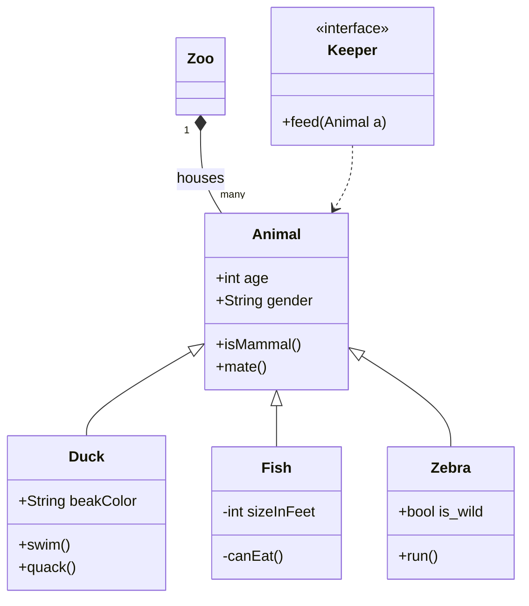
```mermaid
classDiagram
    Animal <|-- Duck
    Animal <|-- Fish
    Animal <|-- Zebra
    Animal : +int age
    Animal : +String gender
    Animal: +isMammal()
    Animal: +mate()
    class Duck{
        +String beakColor
        +swim()
        +quack()
    }
    class Fish{
        -int sizeInFeet
        -canEat()
    }
    class Zebra{
        +bool is_wild
        +run()
    }
    Zoo "1" *-- "many" Animal : houses
    class Keeper {
      <<interface>>
      +feed(Animal a)
    }
    Keeper ..> Animal
```

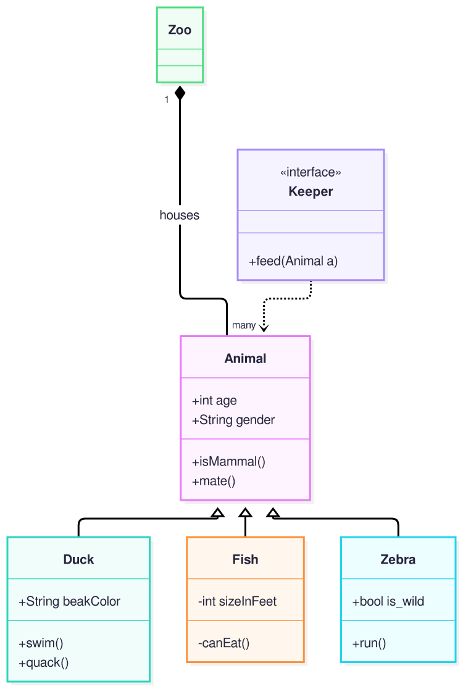

## cynefin

Source: [`examples/diagrams/cynefin.mmd`](../examples/diagrams/cynefin.mmd) · rendered in 210.62µs

source

```mermaid
cynefin-beta
  title Strategy Categorization

  complex
    "Market research"
    "New product bets"

  complicated
    "Competitive analysis"

  clear
    "Standard pricing"

  chaotic
    "Crisis management"

  confusion
    "Unknown failure mode"

  complex --> complicated : "Pattern identified"
  complicated --> clear : "Best practice codified"
  clear --> chaotic : "Complacency"
  chaotic --> complex : "Stabilized"
```

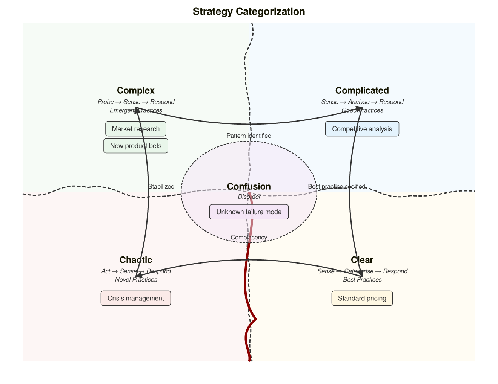

## er-subgraphs

Source: [`examples/diagrams/er-subgraphs.mmd`](../examples/diagrams/er-subgraphs.mmd) · rendered in 446.91µs

source

```mermaid
---
title: Subgraphs in an ER diagram
---
erDiagram
    direction LR
    %% Groups nest, take their own direction, and can be relationship endpoints.
    subgraph TOP [Order domain]
        direction TB
        subgraph B1 [Customers]
            direction RL
            CUSTOMER ||--o{ ADDRESS : "lives at"
        end
        subgraph B2 [Orders]
            direction BT
            ORDER ||--|{ LINE-ITEM : contains
        end
    end
    subgraph "Catalogue"
        PRODUCT {
            string code PK
            string name
        }
    end
    WAREHOUSE ||--|| TOP : serves
    TOP ||--o{ Catalogue : sells
    B1 ||--|| B2 : places
    style Catalogue fill:#fff7e6,stroke:#d48806
```

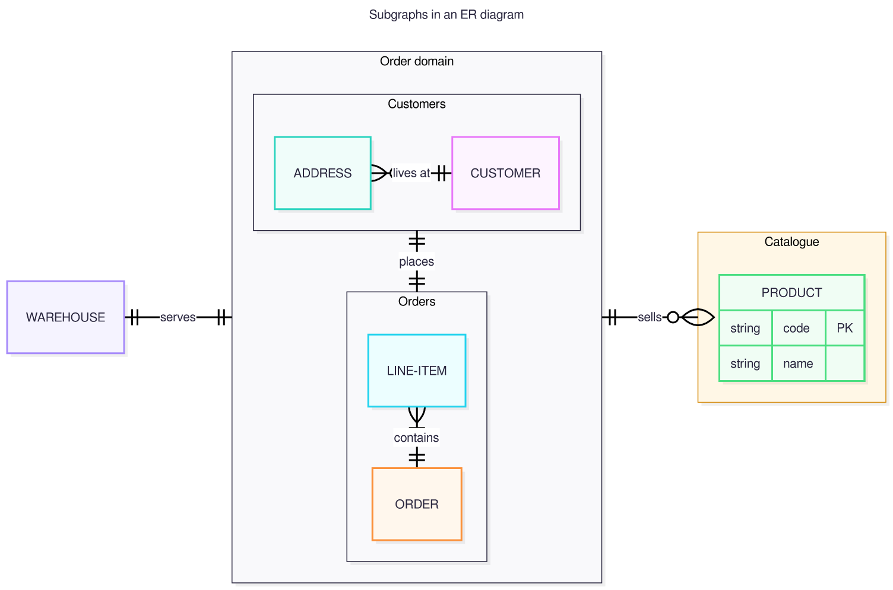

## er

Source: [`examples/diagrams/er.mmd`](../examples/diagrams/er.mmd) · rendered in 341.98µs

source

```mermaid
---
title: Order management
---
erDiagram
    %% Symbolic cardinalities, identifying (--) and non-identifying (..) links
    CUSTOMER ||--o{ ORDER : places
    CUSTOMER }|..|{ DELIVERY-ADDRESS : uses
    ORDER ||--|{ LINE-ITEM : contains
    PRODUCT |o--o{ LINE-ITEM : "ordered in"
    %% Word cardinalities and an alias
    p[Person]
    p one or more optionally to zero or one CUSTOMER : "acts as"

    CUSTOMER {
        string id PK "customer number"
        string name
        string email UK
    }
    ORDER {
        int orderNumber PK
        string customerId FK
        date placed
    }
    LINE-ITEM {
        string productCode FK
        int quantity
        decimal(10,2) pricePerUnit
    }
    PRODUCT {
        string code PK
        string description
    }
    p {
        string firstName
        string lastName
    }

    classDef highlight fill:#fff5ad,stroke:#aaaa33
    class PRODUCT highlight
```

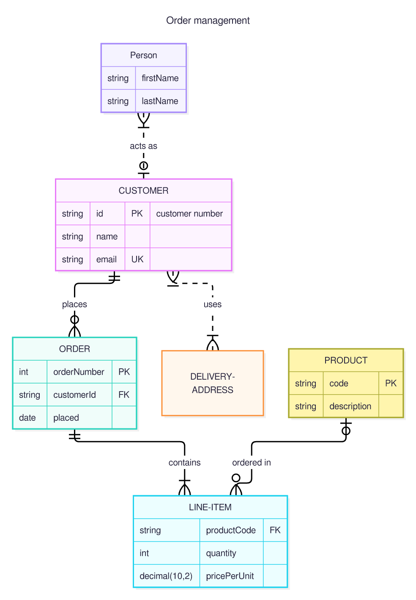

## eventmodeling

Source: [`examples/diagrams/eventmodeling.mmd`](../examples/diagrams/eventmodeling.mmd) · rendered in 189.72µs

source

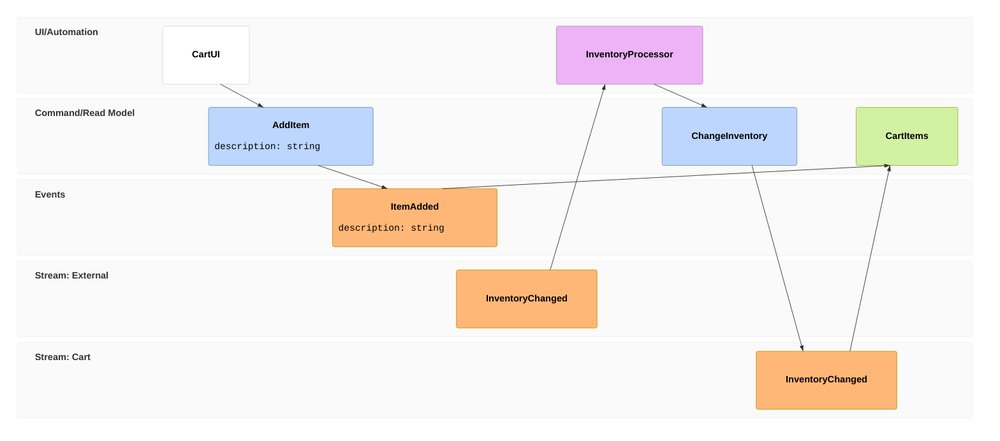
```mermaid
eventmodeling

tf 01 ui CartUI
tf 02 cmd AddItem { description: string }
tf 03 evt ItemAdded { description: string }

rf 04 evt External.InventoryChanged
tf 05 pcr InventoryProcessor
tf 06 cmd ChangeInventory
tf 07 evt Cart.InventoryChanged
tf 08 rmo CartItems ->> 03 ->> 07
```

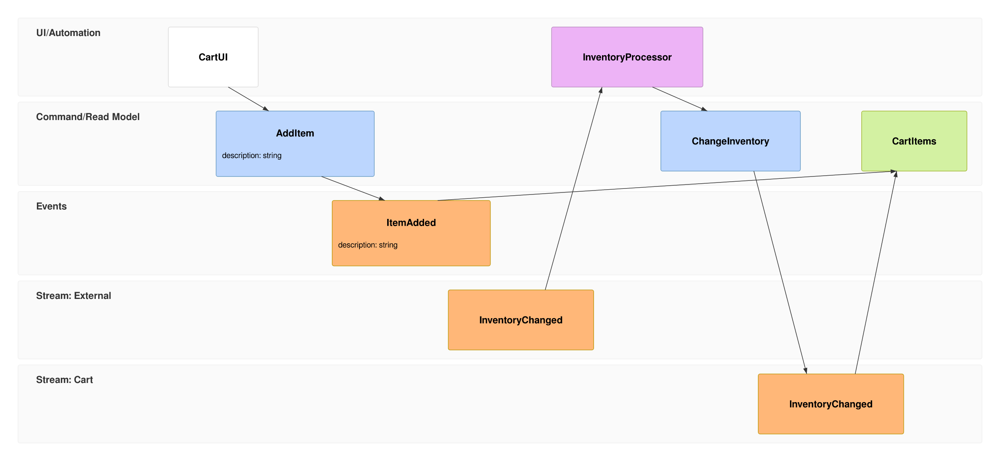

## flowchart

Source: [`examples/diagrams/flowchart.mmd`](../examples/diagrams/flowchart.mmd) · rendered in 303.37µs

source

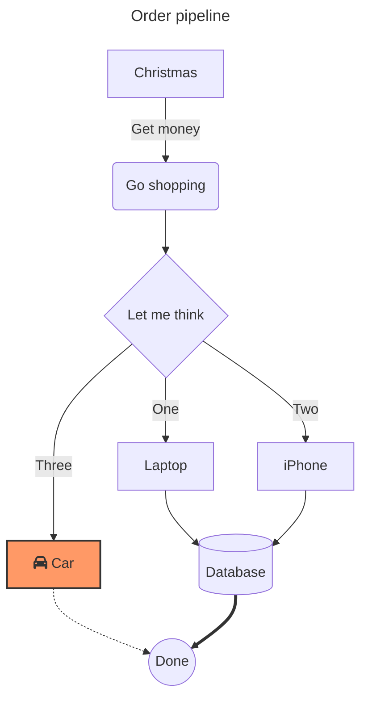
```mermaid
---
title: Order pipeline
---
flowchart TD
    A[Christmas] -->|Get money| B(Go shopping)
    B --> C{Let me think}
    C -->|One| D[Laptop]
    C -->|Two| E[iPhone]
    C -->|Three| F[fa:fa-car Car]
    D --> G[(Database)]
    E --> G
    F -.-> H((Done))
    G ==> H
    classDef hot fill:#f96,stroke:#333,stroke-width:2px
    class F hot
```

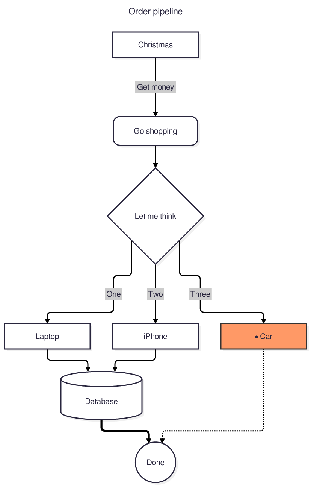

## gantt

Source: [`examples/diagrams/gantt.mmd`](../examples/diagrams/gantt.mmd) · rendered in 794.31µs

source

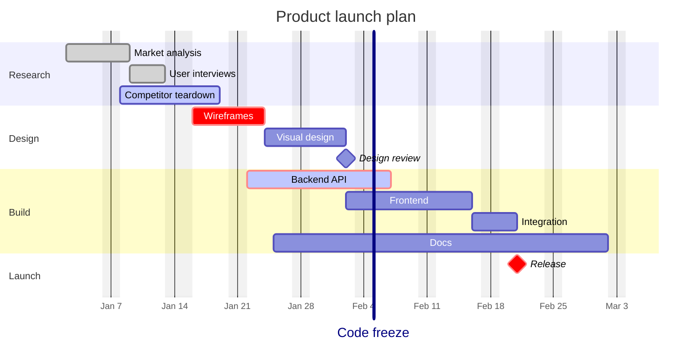
```mermaid
gantt
    title Product launch plan
    dateFormat YYYY-MM-DD
    axisFormat %b %e
    excludes weekends, 2024-01-15
    %% todayMarker is accepted but never drawn (output must be deterministic)
    todayMarker off

    section Research
    Market analysis        :done, res1, 2024-01-02, 5d
    User interviews        :done, res2, after res1, 4d
    Competitor teardown    :active, res3, 2024-01-08, 2024-01-19

    section Design
    Wireframes             :crit, des1, after res2, 6d
    Visual design          :des2, after des1, 1w
    Design review          :milestone, m1, after des2, 0d

    section Build
    Backend API            :crit, active, dev1, 2024-01-22, 12d
    Frontend               :dev2, after des2, 10d
    Integration            :dev3, after dev1 dev2, 3d
    Docs                   :doc1, 2024-01-25, until rel

    section Launch
    Release                :milestone, crit, rel, after dev3, 0d
    Code freeze            :vert, v1, 2024-02-05, 0d
```

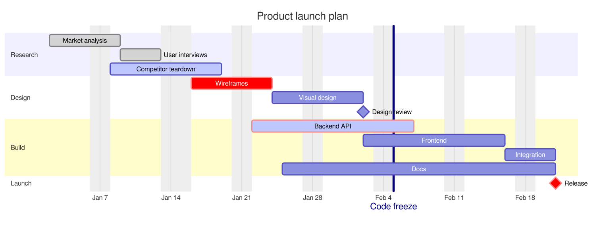

## gitgraph

Source: [`examples/diagrams/gitgraph.mmd`](../examples/diagrams/gitgraph.mmd) · rendered in 185.71µs

source

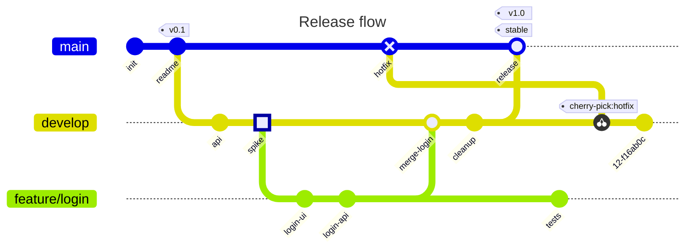
```mermaid
---
title: Release flow
---
gitGraph
  commit id: "init"
  commit id: "readme" tag: "v0.1"
  branch develop
  checkout develop
  commit id: "api"
  commit id: "spike" type: HIGHLIGHT
  branch feature/login order: 3
  commit id: "login-ui"
  commit id: "login-api"
  checkout main
  commit id: "hotfix" type: REVERSE
  checkout develop
  merge feature/login id: "merge-login"
  commit id: "cleanup"
  checkout main
  merge develop id: "release" tag: "v1.0" tag: "stable"
  switch feature/login
  commit id: "tests"
  checkout develop
  cherry-pick id: "hotfix"
  commit
```

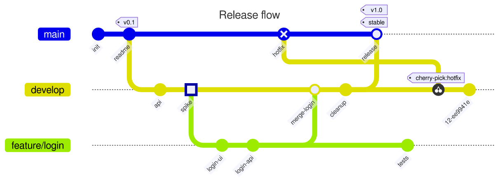

## info

Source: [`examples/diagrams/info.mmd`](../examples/diagrams/info.mmd) · rendered in 92.65µs

source

```mermaid
info showInfo
```

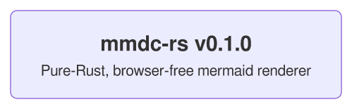

## ishikawa

Source: [`examples/diagrams/ishikawa.mmd`](../examples/diagrams/ishikawa.mmd) · rendered in 183.24µs

source

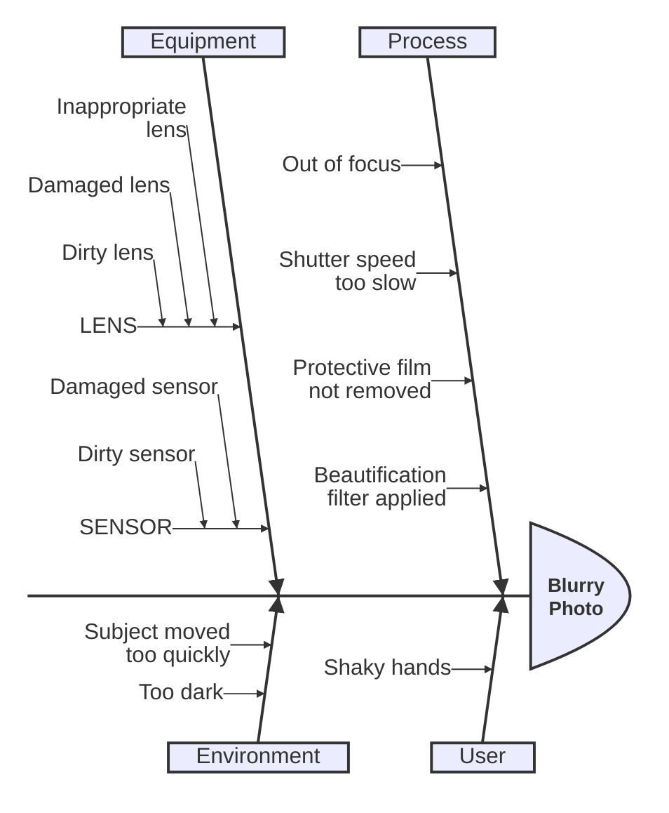
```mermaid
ishikawa-beta
    Blurry Photo
    Process
        Out of focus
        Shutter speed too slow
        Protective film not removed
        Beautification filter applied
    User
        Shaky hands
    Equipment
        LENS
            Inappropriate lens
            Damaged lens
            Dirty lens
        SENSOR
            Damaged sensor
            Dirty sensor
    Environment
        Subject moved too quickly
        Too dark
```

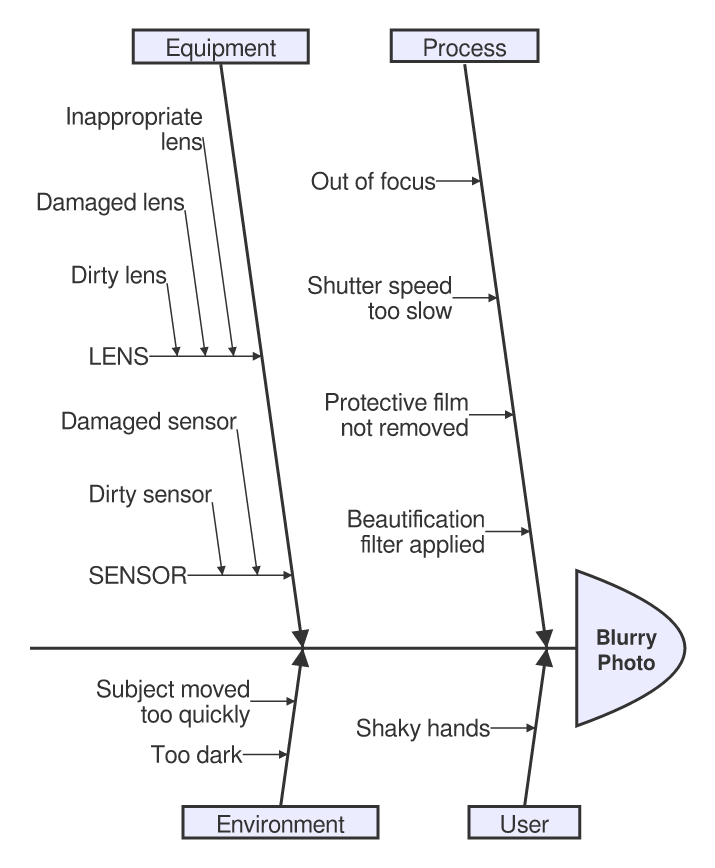

## journey

Source: [`examples/diagrams/journey.mmd`](../examples/diagrams/journey.mmd) · rendered in 249.97µs

source

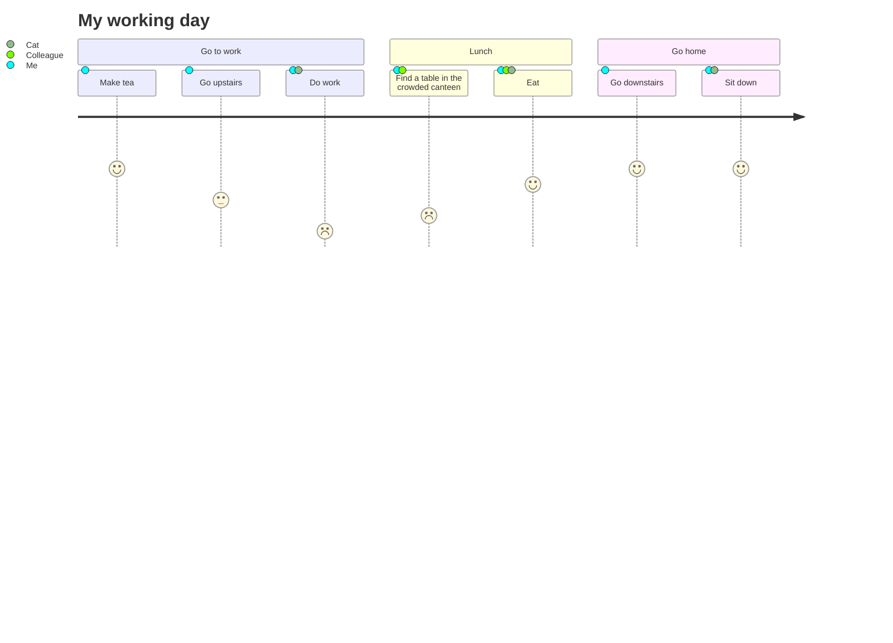
```mermaid
journey
    title My working day
    section Go to work
      Make tea: 5: Me
      Go upstairs: 3: Me
      Do work: 1: Me, Cat
    section Lunch
      Find a table in the crowded canteen: 2: Me, Colleague
      Eat: 4: Me, Colleague, Cat
    section Go home
      Go downstairs: 5: Me
      Sit down: 5: Me, Cat
```

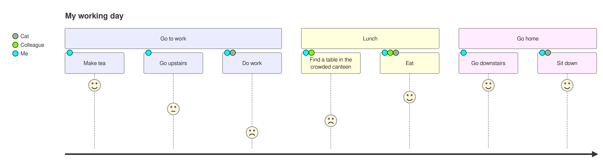

## kanban

Source: [`examples/diagrams/kanban.mmd`](../examples/diagrams/kanban.mmd) · rendered in 461.25µs

source

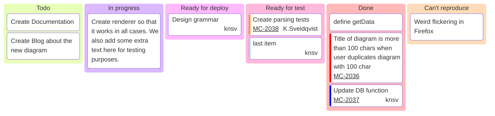
```mermaid
---
config:
  kanban:
    ticketBaseUrl: 'https://example.com/browse/#TICKET#'
---
kanban
  Todo
    [Create Documentation]
    docs[Create Blog about the new diagram]
  [In progress]
    id6[Create renderer so that it works in all cases. We also add some extra text here for testing purposes.]
  id9[Ready for deploy]
    id8[Design grammar]@{ assigned: 'knsv' }
  id10[Ready for test]
    id4[Create parsing tests]@{ ticket: MC-2038, assigned: 'K.Sveidqvist', priority: 'High' }
    id66[last item]@{ priority: 'Very Low', assigned: 'knsv' }
  id11[Done]
    id5[define getData]
    id2[Title of diagram is more than 100 chars when user duplicates diagram with 100 char]@{ ticket: MC-2036, priority: 'Very High'}
    id3[Update DB function]@{ ticket: MC-2037, assigned: knsv, priority: 'Low' }
  id12[Can't reproduce]
    id13[Weird flickering in Firefox]
```

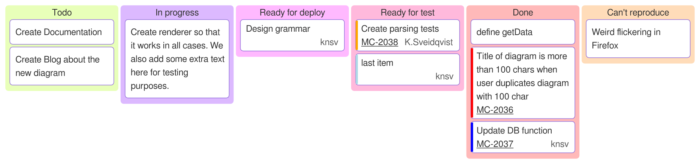

## mindmap

Source: [`examples/diagrams/mindmap.mmd`](../examples/diagrams/mindmap.mmd) · rendered in 238.85µs

source

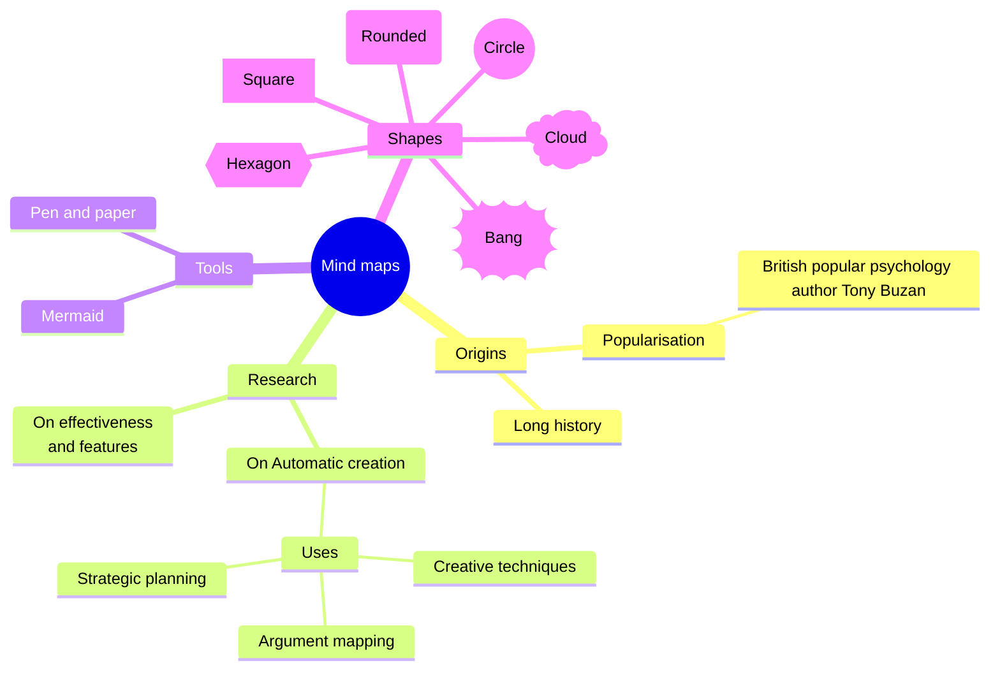
```mermaid
mindmap
  root((Mind maps))
    Origins
      Long history
      ::icon(fa fa-book)
      Popularisation
        British popular psychology author Tony Buzan
    Research
      On effectiveness<br/>and features
      On Automatic creation
        Uses
            Creative techniques
            Strategic planning
            Argument mapping
    Tools
      Pen and paper
      Mermaid
    Shapes
      sq[Square]
      rd(Rounded)
      :::urgent
      bg))Bang((
      cl)Cloud(
      hx{{Hexagon}}
      ci((Circle))
```

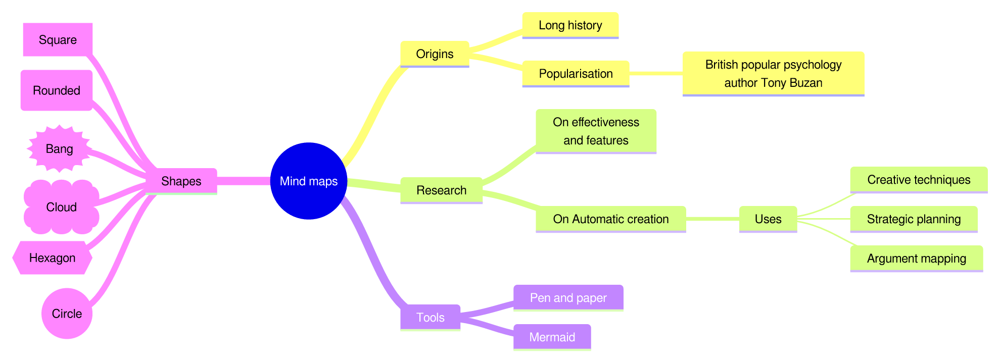

## packet

Source: [`examples/diagrams/packet.mmd`](../examples/diagrams/packet.mmd) · rendered in 274.74µs

source

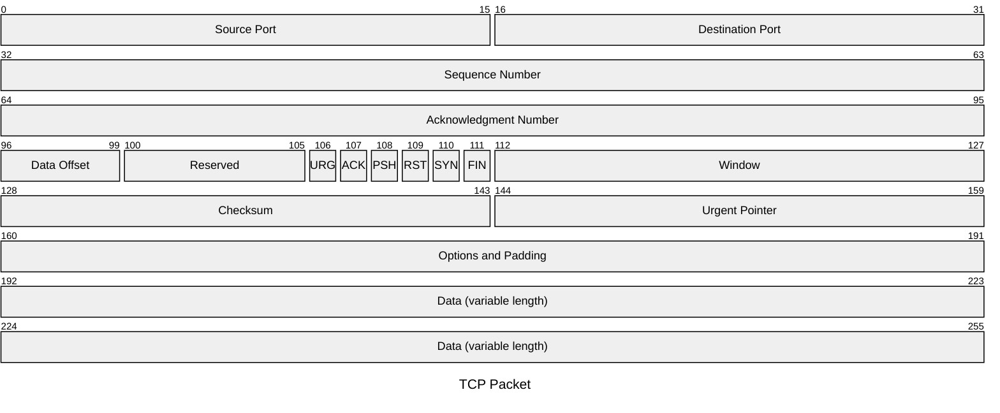
```mermaid
---
title: "TCP Packet"
---
packet-beta
0-15: "Source Port"
16-31: "Destination Port"
32-63: "Sequence Number"
64-95: "Acknowledgment Number"
96-99: "Data Offset"
100-105: "Reserved"
106: "URG"
107: "ACK"
108: "PSH"
109: "RST"
110: "SYN"
111: "FIN"
112-127: "Window"
128-143: "Checksum"
144-159: "Urgent Pointer"
+32: "Options and Padding"
+64: "Data (variable length)"
```

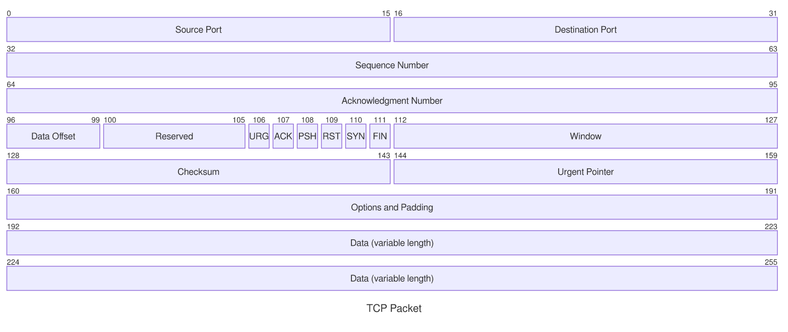

## pie

Source: [`examples/diagrams/pie.mmd`](../examples/diagrams/pie.mmd) · rendered in 110.82µs

source

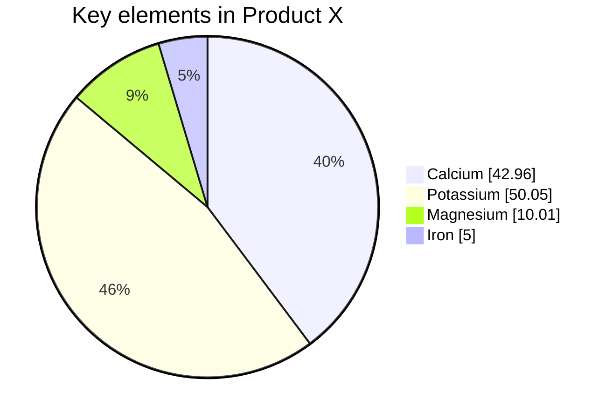
```mermaid
pie showData
    title Key elements in Product X
    "Calcium" : 42.96
    "Potassium" : 50.05
    "Magnesium" : 10.01
    "Iron" :  5
```

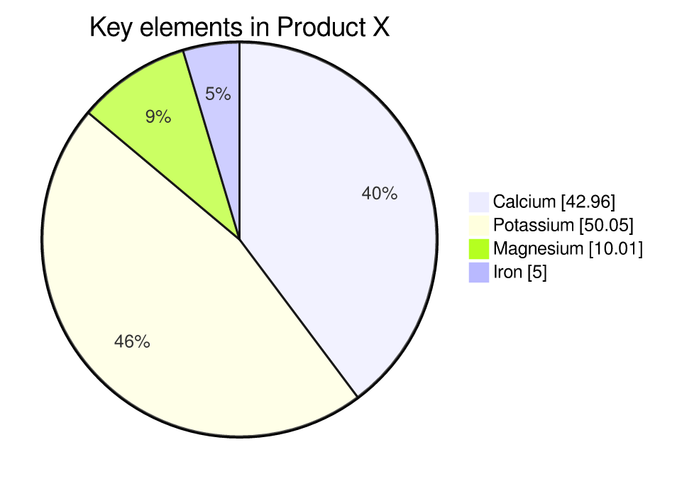

## quadrant

Source: [`examples/diagrams/quadrant.mmd`](../examples/diagrams/quadrant.mmd) · rendered in 168.04µs

source

```mermaid
quadrantChart
    title Reach and engagement of campaigns
    x-axis Low Reach --> High Reach
    y-axis Low Engagement --> High Engagement
    quadrant-1 We should expand
    quadrant-2 Need to promote
    quadrant-3 Re-evaluate
    quadrant-4 May be improved
    Campaign A: [0.3, 0.6]
    Campaign B: [0.45, 0.23] radius: 9
    Campaign C:::hot: [0.57, 0.69]
    Campaign D: [0.78, 0.34] color: #ff3300, radius: 10
    Campaign E:::cool: [0.40, 0.84]
    Campaign F: [0.15, 0.35] radius: 12, color: #00b36b, stroke-color: #10508f, stroke-width: 3px
    classDef hot color: #e8590c, radius: 8, stroke-color: #862e07, stroke-width: 2px
    classDef cool color: #1c7ed6, radius: 7
```

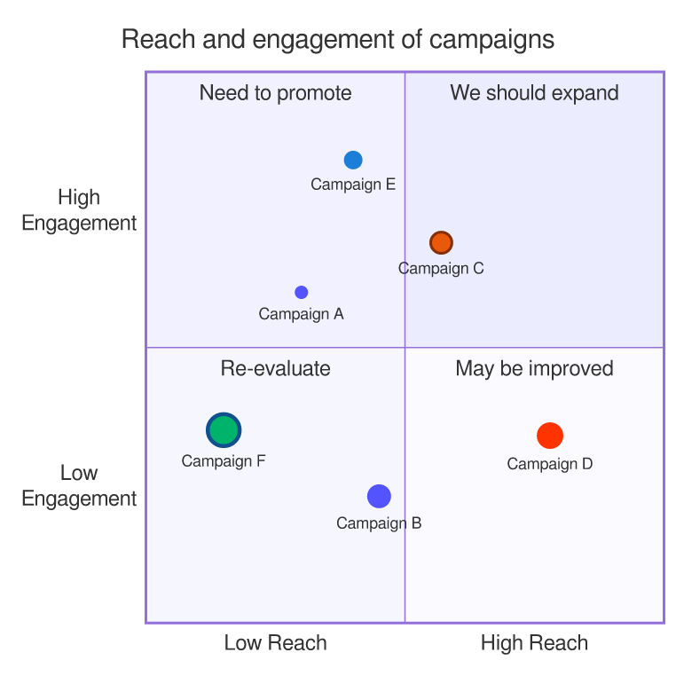

## radar

Source: [`examples/diagrams/radar.mmd`](../examples/diagrams/radar.mmd) · rendered in 181.04µs

source

```mermaid
---
title: "Grades"
---
radar-beta
  axis m["Math"], s["Science"], e["English"]
  axis h["History"], g["Geography"], a["Art"]
  curve a["Alice"]{85, 90, 80, 70, 75, 90}
  curve b["Bob"]{70, 75, 85, 80, 90, 85}
  curve c["Carol"]{ m: 60, s: 65, e: 95, h: 90, g: 70, a: 55 }

  max 100
  min 0
  graticule polygon
  ticks 5
  showLegend true
```

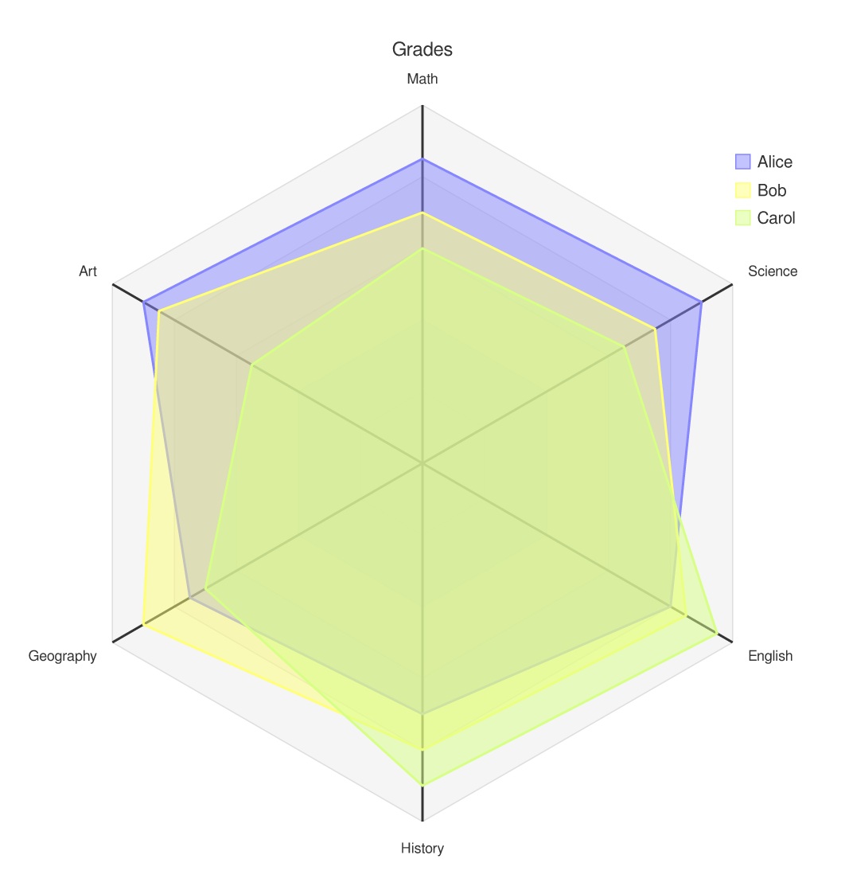

## railroad-abnf

Source: [`examples/diagrams/railroad-abnf.mmd`](../examples/diagrams/railroad-abnf.mmd) · rendered in 239.65µs

source

```mermaid
railroad-abnf-beta
title "Email Address"

address = local-part "@" domain ;
local-part = 1*( ALPHA / DIGIT / "." / "-" ) ;
domain = label *( "." label ) ;
label = 1*( ALPHA / DIGIT / "-" ) ;
port = [ ":" ] 1*5DIGIT %x30-39 ;
```

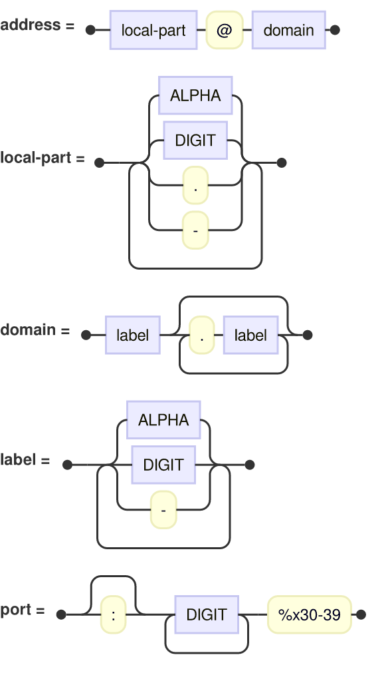

## railroad-ir

Source: [`examples/diagrams/railroad-ir.mmd`](../examples/diagrams/railroad-ir.mmd) · rendered in 185.60µs

source

```mermaid
railroad-beta
title Expression Grammar

expression = sequence(
    nonterminal("term"),
    zeroOrMore(sequence(
        choice(terminal("+"), terminal("-")),
        nonterminal("term")
    ))
) ;
factor = choice(
    nonterminal("number"),
    sequence(terminal("("), nonterminal("expression"), terminal(")"))
) ;
number = sequence(optional(terminal("-")), oneOrMore(nonterminal("digit")), special("exponent")) ;
```

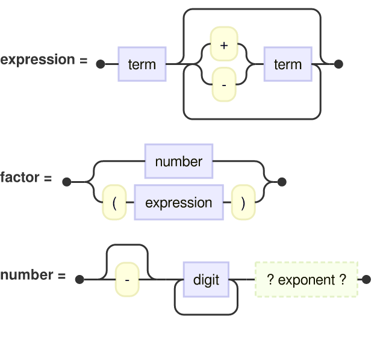

## railroad-peg

Source: [`examples/diagrams/railroad-peg.mmd`](../examples/diagrams/railroad-peg.mmd) · rendered in 216.98µs

source

```mermaid
railroad-peg-beta
title "Calculator Grammar"

Expression <- Term (("+" / "-") Term)* ;
Term <- Factor (("*" / "/") Factor)* ;
Factor <- Number / "(" Expression ")" ;
Number <- Digit+ ;
Identifier <- !Keyword Letter Letter* . ;
```

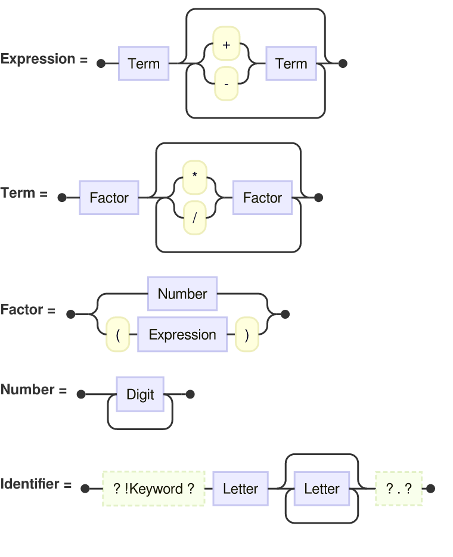

## railroad

Source: [`examples/diagrams/railroad.mmd`](../examples/diagrams/railroad.mmd) · rendered in 224.50µs

source

```mermaid
railroad-ebnf-beta
title "JSON Grammar"

json = element ;
element = object | array | string | number | "true" | "false" | "null" ;
object = "{" [ member ( "," member )* ] "}" ;
array = "[" [ element ( "," element )* ] "]" ;
member = string ":" element ;
string = '"' { ? any character except quote ? } '"' ;
```

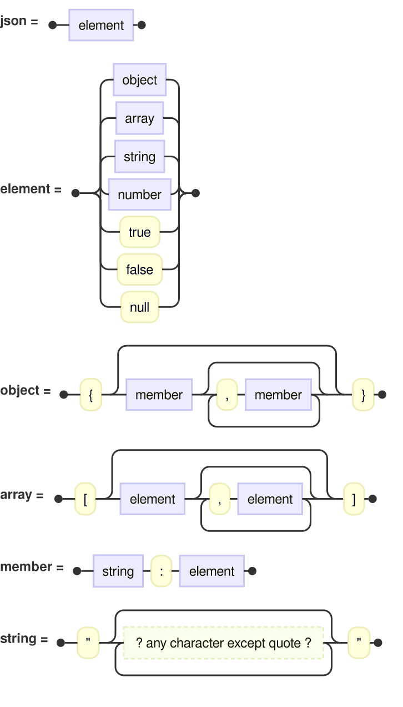

## requirement

Source: [`examples/diagrams/requirement.mmd`](../examples/diagrams/requirement.mmd) · rendered in 344.20µs

source

```mermaid
requirementDiagram
    direction TB

    requirement test_req {
    id: 1
    text: the test text.
    risk: high
    verifymethod: test
    }

    functionalRequirement test_req2 {
    id: 1.1
    text: the second test text.
    risk: low
    verifymethod: inspection
    }

    performanceRequirement test_req3 {
    id: 1.2
    text: the third test text.
    risk: medium
    verifymethod: demonstration
    }

    interfaceRequirement test_req4 {
    id: 1.2.1
    text: the fourth test text.
    risk: medium
    verifymethod: analysis
    }

    physicalRequirement test_req5 {
    id: 1.2.2
    text: the fifth test text.
    risk: medium
    verifymethod: analysis
    }

    designConstraint test_req6:::critical {
    id: 1.2.3
    text: "the sixth test text."
    risk: medium
    verifymethod: analysis
    }

    element test_entity {
    type: simulation
    }

    element test_entity2 {
    type: word doc
    docRef: reqs/test_entity
    }

    element test_entity3 {
    type: "test suite"
    docRef: github.com/all_the_tests
    }

    test_entity - satisfies -> test_req2
    test_req - traces -> test_req2
    test_req - contains -> test_req3
    test_req3 - contains -> test_req4
    test_req4 - derives -> test_req5
    test_req5 - refines -> test_req6
    test_entity3 - verifies -> test_req5
    test_req <- copies - test_entity2

    classDef critical fill:#ffe0e0,stroke:#d33
```

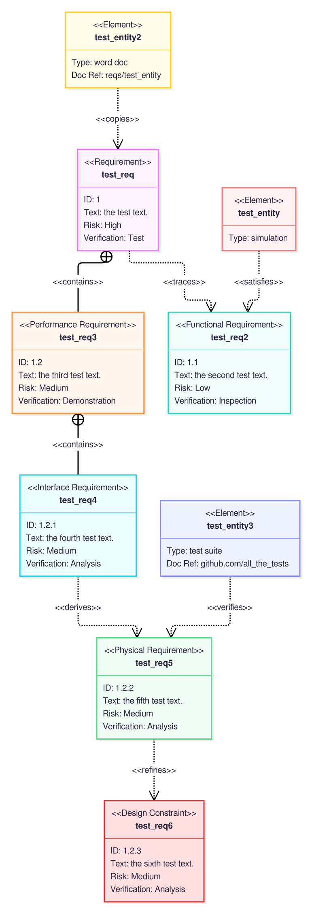

## sankey

Source: [`examples/diagrams/sankey.mmd`](../examples/diagrams/sankey.mmd) · rendered in 976.82µs

source

```mermaid
---
config:
  sankey:
    width: 800
    height: 460
    suffix: " TWh"
---
sankey-beta

%% source,target,value
Agricultural 'waste',Bio-conversion,124.729
Bio-conversion,Liquid,0.597
Bio-conversion,Losses,26.862
Bio-conversion,Solid,280.322
Bio-conversion,Gas,81.144
Biofuel imports,Liquid,35
Biomass imports,Solid,35
Coal imports,Coal,11.606
Coal reserves,Coal,63.965
Coal,Solid,75.571
Gas,Heating and cooling - commercial,22.567
Gas,"Heating and cooling, homes",46.477
Gas,Industry,30.1
Liquid,Industry,10.6
Liquid,Transport,25.6
Solid,Industry,280.0
Solid,Thermal generation,111.893
Thermal generation,Electricity grid,82.0
Thermal generation,Losses,30.0
Electricity grid,Industry,40.0
Electricity grid,"Heating and cooling, homes",42.0
"Wind ""offshore""",Electricity grid,35.0
```

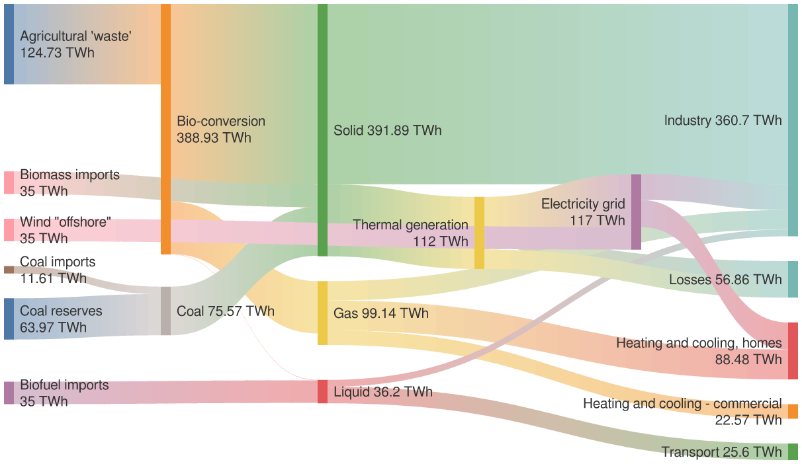

## sequence

Source: [`examples/diagrams/sequence.mmd`](../examples/diagrams/sequence.mmd) · rendered in 201.18µs

source

```mermaid
sequenceDiagram
    title Login flow
    autonumber
    actor U as User
    participant B as Browser
    participant S as Server
    participant D as Database
    U->>B: Enter credentials
    B->>+S: POST /login
    S->>+D: SELECT user
    D-->>-S: row
    alt valid password
        S-->>B: 200 OK + cookie
    else invalid
        S--xB: 401 Unauthorized
    end
    deactivate S
    Note over B,S: TLS everywhere
    loop every 5 minutes
        B-)S: heartbeat
    end
    Note right of D: replicated
```

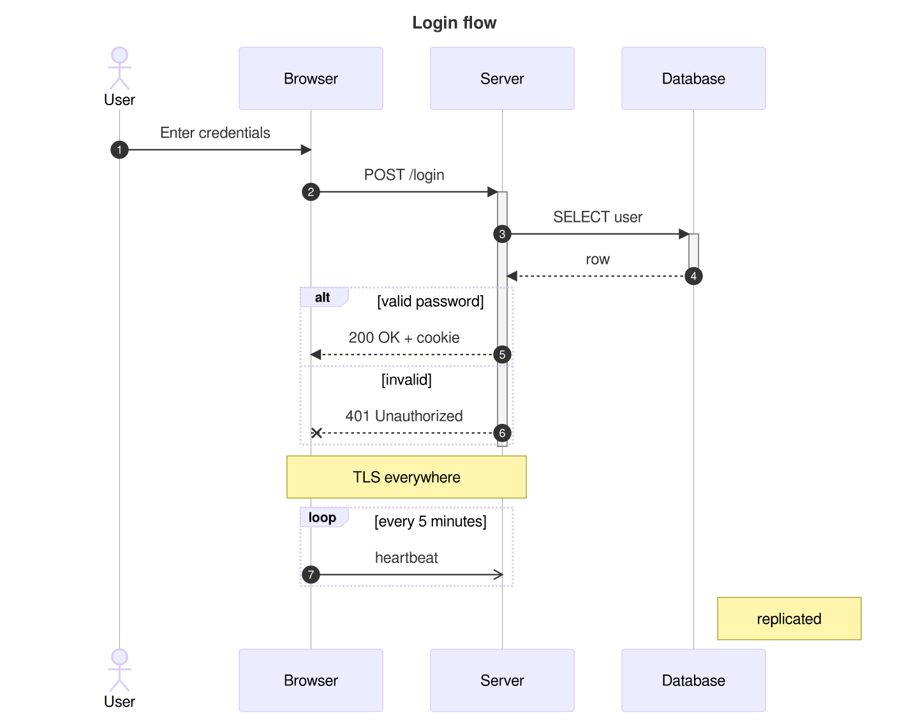

## shapes

Source: [`examples/diagrams/shapes.mmd`](../examples/diagrams/shapes.mmd) · rendered in 825.06µs

source

```mermaid
---
title: Flowchart shapes
---
flowchart LR
    subgraph classic [Classic syntax]
        direction LR
        a1[Rect] ~~~ a2(Rounded) ~~~ a3([Stadium]) ~~~ a4[[Subroutine]]
        b1[(Cylinder)] ~~~ b2((Circle)) ~~~ b3(((Double))) ~~~ b4>Odd]
        c1{Diamond} ~~~ c2{{Hexagon}} ~~~ c3[/Lean right/] ~~~ c4[\Lean left\]
        d1[/Trapezoid\] ~~~ d2[\Inv trapezoid/]
    end
    subgraph expanded [Expanded @-syntax]
        direction LR
        e1@{ shape: notch-rect, label: "Card" } ~~~ e2@{ shape: lin-rect, label: "Lined" } ~~~ e3@{ shape: delay, label: "Delay" } ~~~ e4@{ shape: doc, label: "Document" }
        f1@{ shape: tri, label: "Extract" } ~~~ f2@{ shape: flip-tri, label: "Manual file" } ~~~ f3@{ shape: sl-rect, label: "Manual input" } ~~~ f4@{ shape: win-pane, label: "Storage" }
        g1@{ shape: div-rect, label: "Divided" } ~~~ g2@{ shape: notch-pent, label: "Loop limit" } ~~~ g3@{ shape: st-rect, label: "Processes" } ~~~ g4@{ shape: tag-rect, label: "Tagged" }
        h1@{ shape: lin-cyl, label: "Disk" } ~~~ h2@{ shape: h-cyl, label: "DAS" } ~~~ h3@{ shape: curv-trap, label: "Display" } ~~~ h4@{ shape: text, label: "Just text" }
        i1@{ shape: hourglass } ~~~ i2@{ shape: cross-circ } ~~~ i3@{ shape: sm-circ } ~~~ i4@{ shape: fr-circ } ~~~ i5@{ shape: fork }
        j1@{ shape: docs, label: "Documents" } ~~~ j2@{ shape: tag-doc, label: "Tagged doc" } ~~~ j3@{ shape: lin-doc, label: "Lined doc" } ~~~ j4@{ shape: flag, label: "Paper tape" } ~~~ j5@{ shape: bow-rect, label: "Stored data" }
        k1@{ shape: datastore, label: "Data store" } ~~~ k2@{ shape: folder, label: "Folder" } ~~~ k3@{ shape: bucket, label: "Bucket" } ~~~ k4@{ shape: cyl, label: "Database" }
        l1@{ shape: console, label: "Console" } ~~~ l2@{ shape: browser, label: "Browser" } ~~~ l3@{ shape: person, label: "Person" } ~~~ l4@{ shape: bolt }
        m1@{ shape: bang, label: "Bang" } ~~~ m2@{ shape: cloud, label: "Cloud" } ~~~ m3@{ shape: brace, label: "Comment" } ~~~ m4@{ shape: brace-r, label: "Right" } ~~~ m5@{ shape: braces, label: "Both" }
    end
```

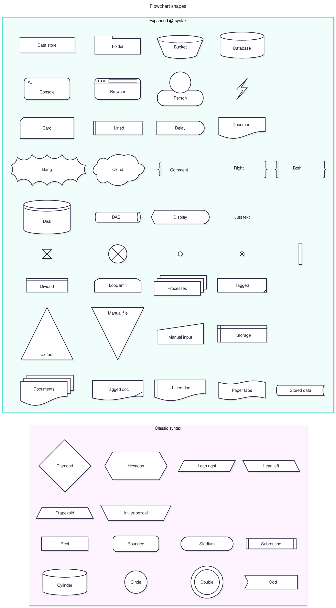

## state

Source: [`examples/diagrams/state.mmd`](../examples/diagrams/state.mmd) · rendered in 329.74µs

source

```mermaid
stateDiagram-v2
    [*] --> Still
    Still --> [*]
    Still --> Moving : push
    Moving --> Still : stop
    Moving --> Crash
    Crash --> [*]
    state Moving {
        [*] --> Slow
        Slow --> Fast : accelerate
        Fast --> Slow : brake
    }
    state check <<choice>>
    Crash --> check
    check --> Still : repaired
```

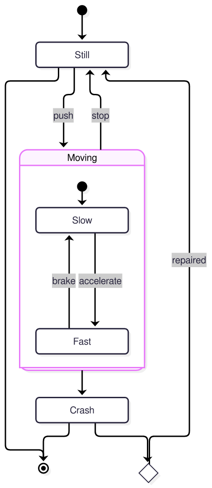

## subgraph-collapse

Source: [`examples/diagrams/subgraph-collapse.mmd`](../examples/diagrams/subgraph-collapse.mmd) · rendered in 338.59µs

source

```mermaid
flowchart LR
    subgraph ingest [Ingest]
        src[Sources] --> parse[Parse] --> validate[Validate]
    end
    subgraph store [Storage]
        direction TB
        raw[(Raw)] --> clean[(Clean)]
    end
    subgraph observability [Observability]
        metrics[Metrics] --> alerts[Alerts]
    end
    user((User)) e1@--> src
    validate --> raw
    validate --> observability
    clean --> store
    observability@{ view: collapsed }
    e1@{ animate: true }
```

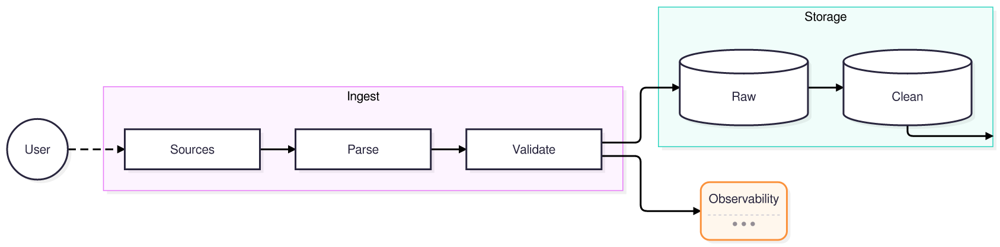

## subgraphs

Source: [`examples/diagrams/subgraphs.mmd`](../examples/diagrams/subgraphs.mmd) · rendered in 326.07µs

source

```mermaid
flowchart LR
    subgraph frontend [Frontend]
        ui[Web UI] --> api_client[API client]
    end
    subgraph backend [Backend]
        direction TB
        api[REST API] --> svc[Service]
        svc --> db[(Postgres)]
        subgraph workers [Workers]
            q[/Queue/] --> w1[Worker 1]
            q --> w2[Worker 2]
        end
        svc --> q
    end
    api_client --> api
    w1 --> db
    w2 --> db
    user((User)) --> ui
```

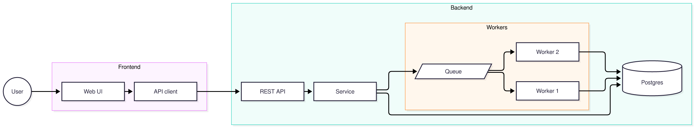

## swimlane

Source: [`examples/diagrams/swimlane.mmd`](../examples/diagrams/swimlane.mmd) · rendered in 249.39µs

source

```mermaid
swimlane-beta LR
  subgraph Applicant
    apply[Submit application]
    sign[Sign agreement]
  end
  subgraph Reviewer
    screen[Screen application]
    decide{Approved?}
  end
  subgraph System
    create[Create account]
    notify[Send welcome email]
  end
  apply -->|Application received| screen
  screen --> decide
  decide -->|Approved| create --> notify --> sign
  decide -->|Needs changes| apply
```

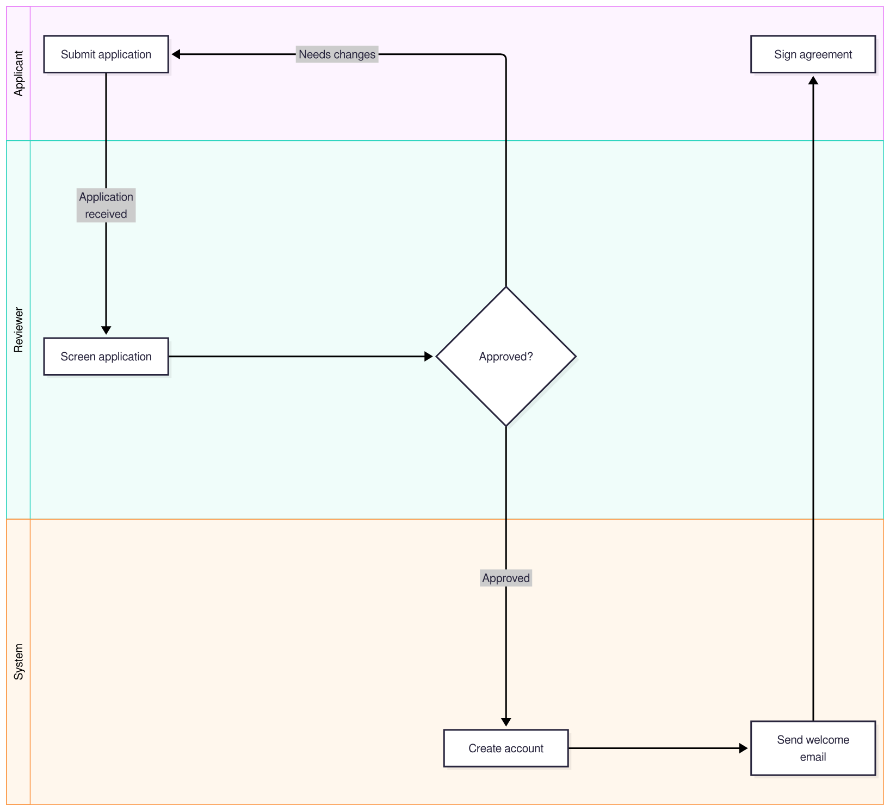

## timeline

Source: [`examples/diagrams/timeline.mmd`](../examples/diagrams/timeline.mmd) · rendered in 327.05µs

source

```mermaid
timeline
    title Timeline of the Industrial Revolution
    section 17th-20th century
        Industry 1.0 : Machinery, Water power, Steam <br>power
        Industry 2.0 : Electricity : Internal combustion engine : Mass production
    section 21st century
        Industry 3.0 : Electronics, Computers, Automation
        Industry 4.0 : Internet
                     : Robotics
                     : Internet of Things
    section Tomorrow
        Industry 5.0 : Human-robot collaboration with sustainable, resilient and human-centric production
```

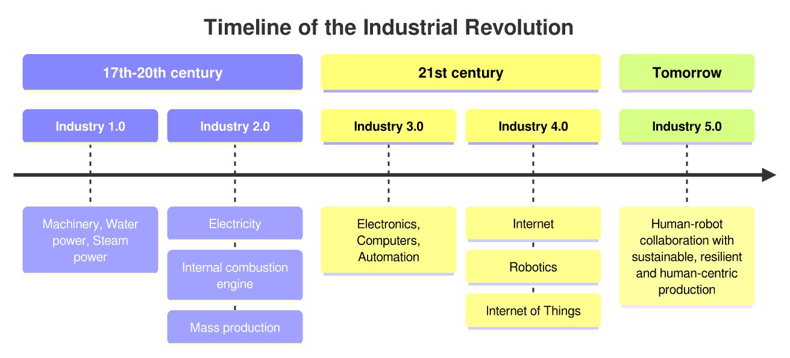

## treemap

Source: [`examples/diagrams/treemap.mmd`](../examples/diagrams/treemap.mmd) · rendered in 164.09µs

source

```mermaid
---
config:
  treemap:
    valueFormat: "$0,0"
---
treemap-beta
title Annual Budget
"Engineering"
    "Platform"
        "Infrastructure": 420000
        "Developer Tools": 180000:::highlight
    "Product"
        "Web App": 350000
        "Mobile": 260000
        "API": 140000
"Operations"
    "Support": 210000
    "Facilities": 150000
    "Legal": 60000
"Marketing"
    "Campaigns": 190000
    "Events": 90000
"Reserve": 80000
classDef highlight fill:#ffd166,stroke:#c77d00,color:#000
```

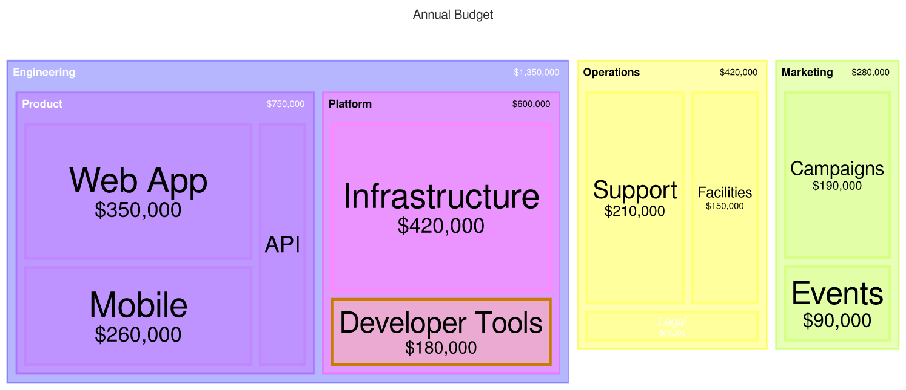

## treeview

Source: [`examples/diagrams/treeview.mmd`](../examples/diagrams/treeview.mmd) · rendered in 138.18µs

source

```mermaid
---
config:
  treeView:
    showIcons: true
---
treeView-beta
    my-project/
        src/
            App.tsx :::highlight icon(logos:react) ## main component
            index.js ## entry point
        .env ## environment variables
        Dockerfile
        package.json
```

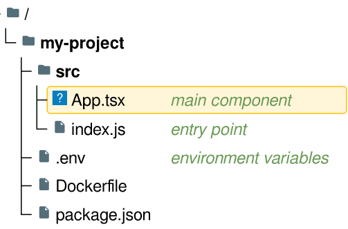

## usecase

Source: [`examples/diagrams/usecase.mmd`](../examples/diagrams/usecase.mmd) · rendered in 478.92µs

source

```mermaid
usecase-beta
direction LR
accTitle: Online ordering use cases
accDescr {
  A customer places an order through the storefront.
  Staff review the order and inspect its data.
}
actor Customer("Customer")
actor Staff("Order staff")@{ type: hollow, business: true } <<Employee>>
systemBoundary ordering["Ordering System"]@{ type: package }:::system
  Browse("Browse products")
  Checkout("Checkout") <<Core>>:::critical
  Payment("Process payment")
  Review[Review order]
end
json OrderData@{
  "status": "pending",
  "items": [{ "name": "Book", "quantity": 1 }],
  "total": 29.95
}:::data
note for Checkout "`Validates the **cart** before payment`"
Customer starts@-- "places order" ---> Checkout
Customer --> Browse
Checkout pays@..> : include Payment
Staff --> Review
Review --> OrderData
classDef system stroke:#c8a02a,stroke-width:2px
classDef critical stroke:#c33,stroke-width:3px
classDef data stroke:#3572a5
starts@{ animation: fast }
style pays stroke:#6b46c1,stroke-width:2px
```

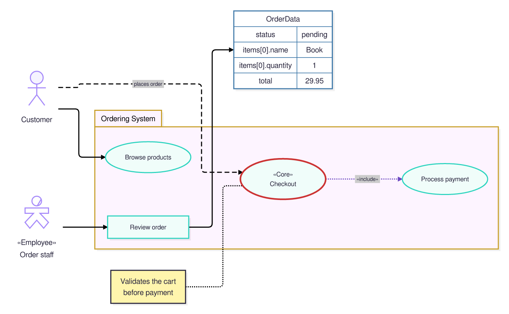

## venn

Source: [`examples/diagrams/venn.mmd`](../examples/diagrams/venn.mmd) · rendered in 406.99µs

source

```mermaid
venn-beta
  title What makes a good feature
  set Desirable
    text D1["User research"]
  set Feasible
  set Viable
  union Desirable,Feasible["Buildable"]
  union Feasible,Viable["Sustainable"]
  union Desirable,Viable["Marketable"]
  union Desirable,Feasible,Viable["Ship it"]
  style Desirable,Feasible,Viable fill:#fde68a
```

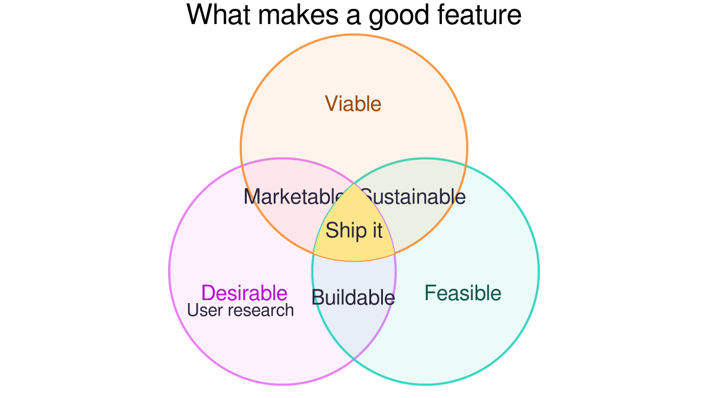

## wardley

Source: [`examples/diagrams/wardley.mmd`](../examples/diagrams/wardley.mmd) · rendered in 198.08µs

source

```mermaid
wardley-beta
title Software Platform Strategy
size [1100, 800]

evolution Genesis@0.25 -> Custom@0.5 -> Product@0.75 -> Commodity@1.0

anchor Customer [0.90, 0.95]

component "Mobile App" [0.80, 0.85] (build)
component "Web App" [0.75, 0.80] label [-60, 10] (build)
component "API Gateway" [0.70, 0.65] (buy)
component "Auth Service" [0.60, 0.55] (outsource)
component "Database" [0.50, 0.45] (buy) (inertia)
component "Cloud Platform" [0.30, 0.95] (market)

Customer -> "Mobile App"
Customer -> "Web App"
"Mobile App" -> "API Gateway"
"Web App" -> "API Gateway"
"API Gateway" +<> "Auth Service"
"API Gateway" +> "Database"
"Database" -.-> "Cloud Platform"; hosting

evolve "API Gateway" 0.85
evolve "Database" 0.75

accelerator "Cloud Native" [0.20, 0.85]
deaccelerator "Legacy Data" [0.45, 0.35]

annotations [0.10, 0.20]
annotation 1,[0.78, 0.82] "User touchpoints"
annotation 2,[0.70, 0.60] "Integration layer"
annotation 3,[0.50, 0.40] "Data persistence"

note "Build mobile-first experience" [0.85, 0.90]
note "Migrate to cloud-native database" [0.60, 0.50]
```

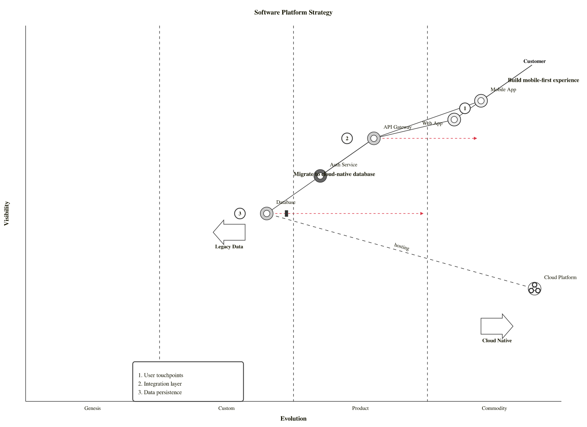

## xychart

Source: [`examples/diagrams/xychart.mmd`](../examples/diagrams/xychart.mmd) · rendered in 183.85µs

source

```mermaid
xychart-beta
    title "Sales Revenue"
    x-axis "Month of year" [jan, feb, mar, apr, may, jun, jul, aug, sep, oct, nov, dec]
    y-axis "Revenue (in $)" 4000 --> 11000
    bar "2024" [5000, 6000, 7500, 8200, 9500, 10500, 11000, 10200, 9200, 8500, 7000, 6000]
    bar "2025" [5400, 6300, 7100, 8800, 9900, 10800, 10600, 9800, 9000, 8300, 7400, 6600]
    line "Target" [5000, 6200, 7000, 8000, 9000, 10000, 10500, 10000, 9500, 8800, 7600, 6400]
```

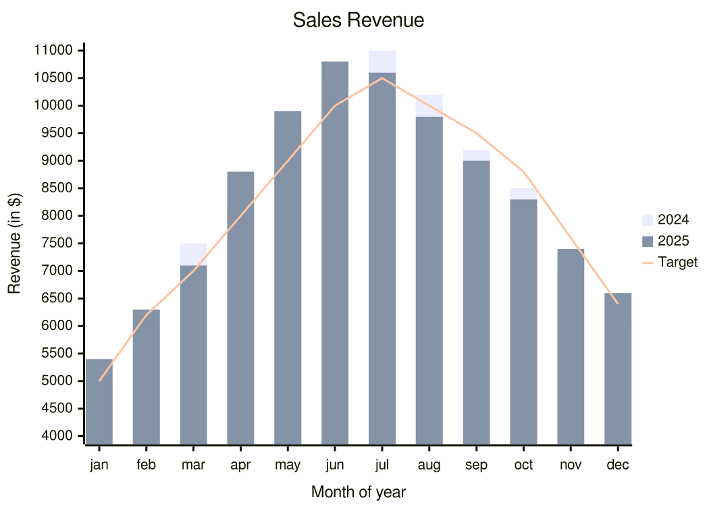

## zenuml

Source: [`examples/diagrams/zenuml.mmd`](../examples/diagrams/zenuml.mmd) · rendered in 215.07µs

source

```mermaid
zenuml
    title Order Service
    @Actor Client
    @Boundary OrderController
    @EC2 <<BFF>> OrderService
    group BusinessService {
      @Lambda PurchaseService
      @AzureFunction InvoiceService
    }
    @Database DB

    @Starter(Client)
    // POST /orders
    receipt = OrderController.post(payload) {
      result = OrderService.create(payload) {
        order = new Order(payload)
        if(order != null) {
          par {
            PurchaseService.createPO(order)
            InvoiceService.createInvoice(order)
          }
        } else {
          @return OrderService->OrderController: invalid order
        }
        try {
          DB.save(order)
        } catch(DuplicateKey) {
          OrderService->Client: already submitted
        }
        while(pending) {
          OrderService.poll()
        }
        return order.id
      }
    }
```

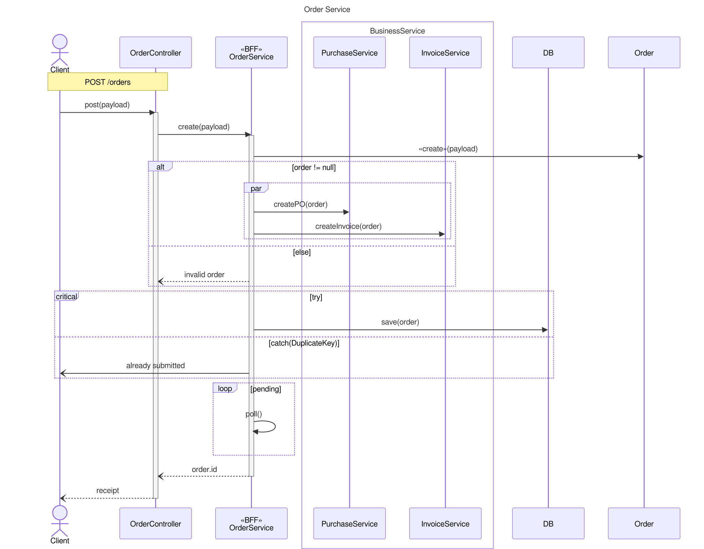

# Themes

Without `-t`, flowchart, sequence, class, state, ER and requirement diagrams use mermaid 12's per-diagram defaults (`redux-color` theme, `neo` look), as above. These are the same sources with an explicit theme (`mmdc -t <theme>`).

## subgraphs · `-t redux-dark-color -b '#333'`

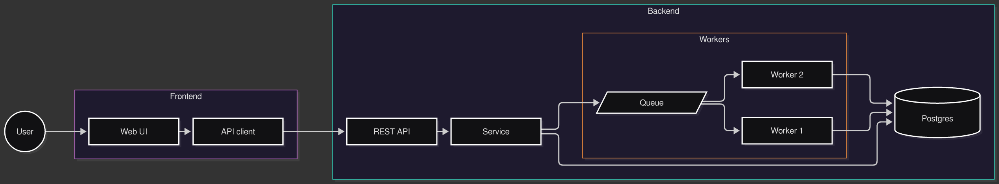

## er · `-t redux-dark-color -b '#333'`

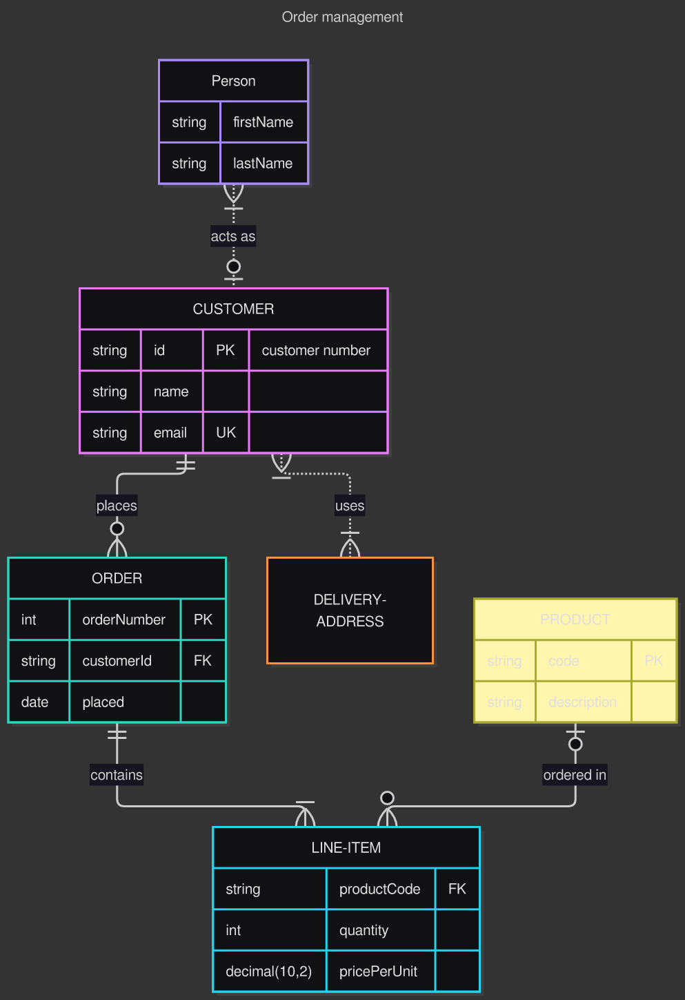

## sequence · `-t redux-dark-color -b '#333'`

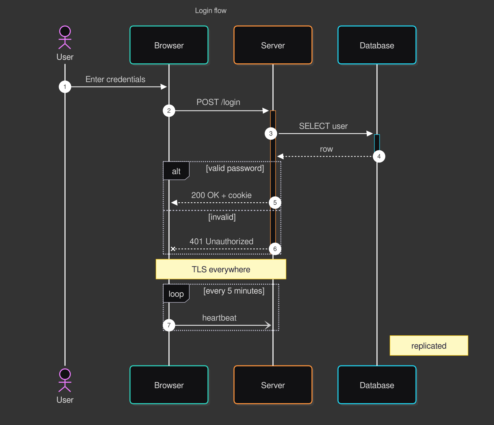

## class · `-t neo`

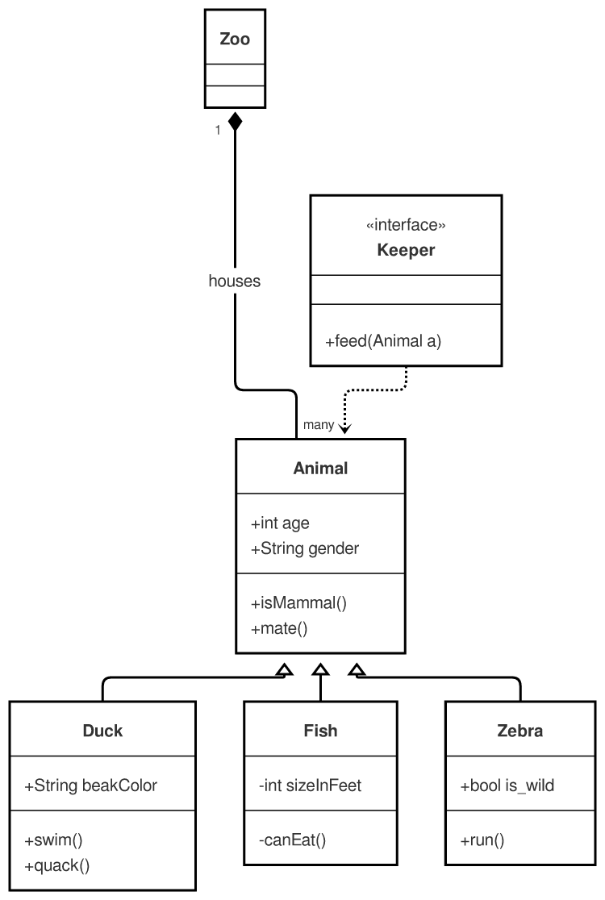

## state · `-t redux`

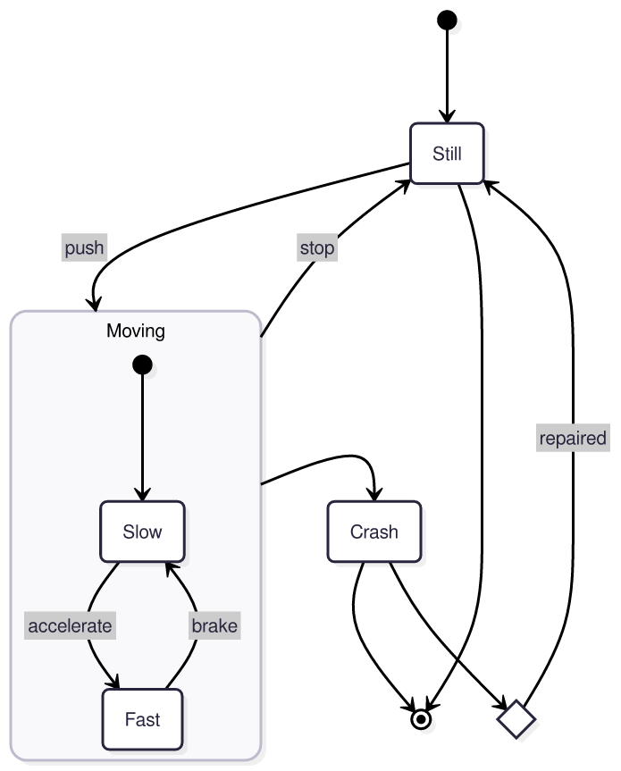

## flowchart · `-t default`

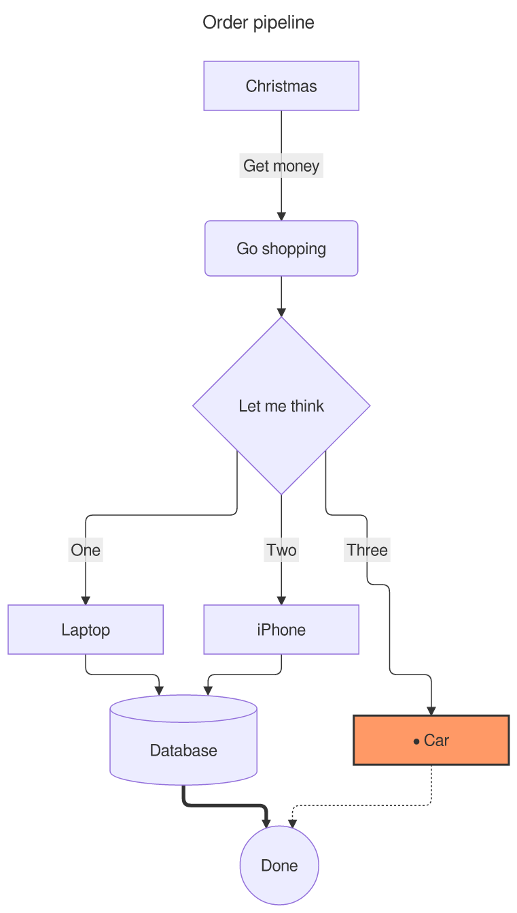

